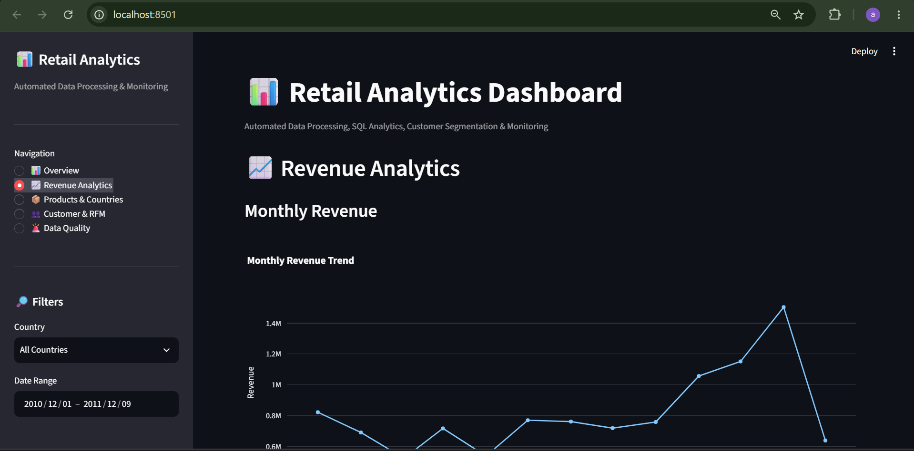

# 🛒 Automated Retail Analytics & Monitoring Pipeline

An end-to-end data analytics project built using **Python, SQL, Pandas, NumPy, SQLite and Streamlit**.

The project processes a large retail transaction dataset, performs automated data validation and cleaning, detects anomalies, stores processed data in SQLite, performs SQL-based business analysis, conducts customer RFM segmentation, and presents the results through an interactive Streamlit dashboard.

---

## 📌 Project Overview

This project simulates a real-world retail analytics workflow where raw transactional data needs to be:

- Validated
- Cleaned
- Processed
- Checked for anomalies
- Stored in a database
- Analyzed using SQL
- Converted into customer insights
- Visualized through an interactive dashboard

The pipeline processes more than **500,000 retail transaction records**.

---

## 🚀 Key Features

### 1. Automated Data Validation

The pipeline automatically checks the dataset for:

- Missing values
- Duplicate records
- Negative quantities
- Zero/negative prices
- Cancelled transactions
- Invalid records

Example validation results:

| Check | Result |
|---|---:|
| Original records | 541,909 |
| Duplicate records | 5,268 |
| Negative quantity records | 10,624 |
| Zero/negative price records | 2,517 |
| Cancelled transactions | 9,288 |

---

### 2. Automated Data Cleaning

Invalid and duplicate records are removed according to defined validation rules.

**Before cleaning:** 541,909 records

**After cleaning:** 524,878 records

**Records removed:** 17,031

The cleaned dataset is automatically saved as:

```text
data/processed/cleaned_retail_data.csv
```

---

### 3. Anomaly Detection

The pipeline uses statistical boundaries based on the **IQR (Interquartile Range)** method to identify unusual values.

Anomalies are detected for:

- Quantity
- Unit Price
- Transaction Value

Example:

```text
Quantity anomalies: 27,111
Price anomalies: 37,827
Transaction Value anomalies: 42,624
```

Anomaly indicators are stored directly in the processed dataset.

---

### 4. Transaction Analysis

Transaction value is calculated using:

```text
Transaction Value = Quantity × Unit Price
```

This allows the pipeline to perform revenue and transaction-level analysis.

---

### 5. SQLite Database

Processed data is automatically loaded into a SQLite database.

Database:

```text
retail_database.db
```

Table:

```text
retail_transactions
```

This allows SQL queries to be used for business analysis.

---

## 📊 SQL Business Analysis

The project performs SQL-based analysis including:

- Total revenue
- Top products by revenue
- Revenue by country
- Top customers by revenue
- Customer order frequency
- Average order value
- Monthly revenue
- Month-over-month revenue growth

### Total Revenue

```text
$10,642,110.80
```

### Top Customer by Revenue

```text
Customer ID: 14646
Revenue: $280,206.02
```

### Most Frequent Customer

```text
Customer ID: 12748
Orders: 209
```

---

## 👥 Customer RFM Analysis

The project performs **RFM (Recency, Frequency, Monetary) analysis** to understand customer behavior.

### RFM Metrics

**Recency**

Number of days since the customer's most recent purchase.

**Frequency**

Number of unique orders placed by the customer.

**Monetary**

Total revenue generated by the customer.

Each customer receives an RFM score and is assigned to a customer segment.

### Customer Segments

The project identifies:

- 🏆 Champions
- 💎 Loyal Customers
- 💰 High Value
- ⚠️ At Risk
- 🔴 Lost Customers
- 👤 Regular Customers

Example segmentation:

| Segment | Customers |
|---|---:|
| Regular Customers | 1,242 |
| Lost Customers | 1,065 |
| Champions | 957 |
| Loyal Customers | 503 |
| At Risk | 453 |
| High Value | 118 |

---

## 📈 Revenue Monitoring

The pipeline monitors month-over-month revenue changes.

Large revenue changes automatically generate alerts.

Example:

```text
ALERT: Revenue dropped -24.25% in 2011-02
ALERT: Revenue increased 37.06% in 2011-03
ALERT: Revenue dropped -25.03% in 2011-04
ALERT: Revenue increased 43.27% in 2011-05
ALERT: Revenue increased 39.40% in 2011-09
ALERT: Revenue increased 30.63% in 2011-11
ALERT: Revenue dropped -57.59% in 2011-12
```

This demonstrates automated monitoring rather than simply performing one-time analysis.

---

# 📊 Interactive Streamlit Dashboard

The project includes an interactive dashboard built using **Streamlit**.

The dashboard provides:

- Total revenue
- Total customers
- Total transactions
- Number of products
- Monthly revenue trends
- Revenue analysis
- Country filtering
- Date range filtering
- Customer analysis
- RFM segmentation
- Revenue monitoring alerts

### Dashboard Preview



---

# 🏗️ Project Architecture

```text
Raw Dataset
     │
     ▼
Data Loading
     │
     ▼
Data Validation
     │
     ├── Missing Values
     ├── Duplicates
     ├── Invalid Quantities
     ├── Invalid Prices
     └── Cancelled Transactions
     │
     ▼
Data Cleaning
     │
     ▼
Anomaly Detection
     │
     ├── Quantity Anomalies
     ├── Price Anomalies
     └── Transaction Value Anomalies
     │
     ▼
Processed Dataset
     │
     ▼
SQLite Database
     │
     ▼
SQL Business Analysis
     │
     ├── Revenue Analysis
     ├── Product Analysis
     ├── Country Analysis
     ├── Customer Analysis
     └── RFM Analysis
     │
     ▼
Revenue Monitoring
     │
     ▼
Streamlit Dashboard
```

---

# 📁 Project Structure

```text
automated-retail-analytics/
│
├── dashboard/
│   └── app.py
│
├── src/
│   ├── analysis.py
│   ├── anomaly_detection.py
│   ├── cleaning.py
│   ├── database.py
│   ├── monitoring.py
│   └── validation.py
│
├── data/
│   ├── raw/
│   │   └── Online Retail.xlsx
│   │
│   └── processed/
│       └── cleaned_retail_data.csv
│
├── main.py
├── requirements.txt
├── .gitignore
└── README.md
```

> The raw dataset and generated database files are excluded from Git using `.gitignore`.

---

# 🛠️ Technologies Used

### Programming

- Python

### Data Analysis

- Pandas
- NumPy

### Database

- SQLite
- SQL

### Visualization

- Streamlit
- Data visualization libraries

### Data Engineering Concepts

- Data validation
- Data cleaning
- ETL pipeline
- Anomaly detection
- Automated monitoring
- Database integration

### Analytics

- Revenue analysis
- Customer analysis
- RFM analysis
- Customer segmentation
- Time-series analysis

---

# ⚙️ Installation

Clone the repository and navigate into the project directory.

Install the required Python libraries:

```bash
pip install -r requirements.txt
```

Place the public Online Retail dataset inside:

```text
data/raw/Online Retail.xlsx
```

---

# ▶️ Running the Pipeline

Run:

```bash
python main.py
```

The pipeline will:

1. Load the dataset
2. Validate the data
3. Clean invalid records
4. Detect anomalies
5. Save the processed dataset
6. Load data into SQLite
7. Perform SQL analysis
8. Perform customer RFM analysis
9. Monitor revenue changes

---

# 📊 Running the Dashboard

Start the Streamlit dashboard using:

```bash
streamlit run dashboard/app.py
```

The dashboard will open in your browser.

---

# 🎯 Business Insights

The analysis demonstrates several useful retail insights:

- The **United Kingdom** generated the majority of revenue.
- A small group of high-value customers contributes significantly to total revenue.
- Customer purchase frequency varies considerably across the customer base.
- Revenue shows significant seasonal and monthly variation.
- November recorded the highest monthly revenue in the analyzed period.
- Revenue monitoring can identify unusually large month-over-month changes.
- RFM segmentation can help businesses identify loyal, high-value and at-risk customers.

---

# 💡 What I Learned

Through this project, I practiced:

- Building an end-to-end data processing pipeline
- Working with a large real-world dataset
- Writing reusable Python modules
- Performing data validation and cleaning
- Detecting statistical anomalies
- Working with SQL and SQLite
- Performing customer segmentation using RFM
- Creating interactive dashboards with Streamlit
- Implementing automated monitoring
- Managing a data analytics project using Git and GitHub

---

# 👨‍💻 Author

**Ganesh Jadhav**

Aspiring Data Analyst / Data Scientist

Skills:

```text
Python | SQL | Pandas | NumPy | Data Analysis |
Machine Learning | Streamlit | SQLite | Git | GitHub
```